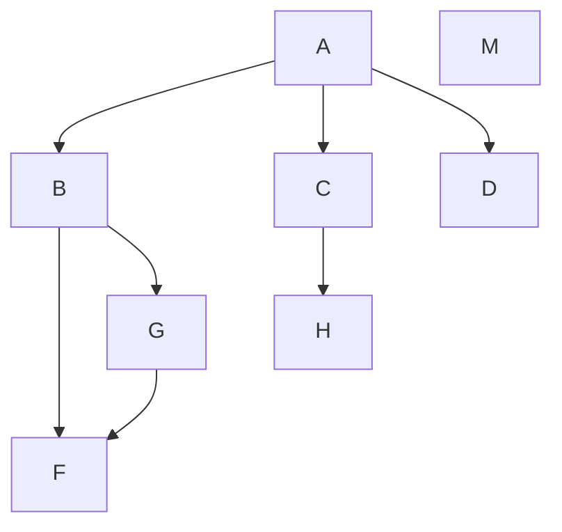

<!--
 * @Author: binbin 81745365+bin59@users.noreply.github.com
 * @Date: 2023-02-22 19:43:07
 * @LastEditors: binbin 81745365+bin59@users.noreply.github.com
 * @LastEditTime: 2023-02-22 20:11:11
 * @FilePath: \web\study-web\Markdown\Markdown技巧.md
 * @Description:
 *
 * Copyright (c) 2023 by ${git_name_email}, All Rights Reserved.
-->

- _https://www.bbsmax.com/A/x9J2QZlWz6/_

## 区块

> 这里是区块

> 这里是区块
> 这里是区块

> 这里是嵌套区块
>
> > 这里是嵌套区块
> >
> > > 这里是嵌套区块
