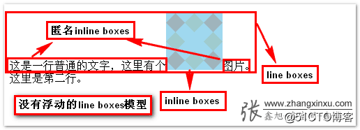

# html中空白节点属性,CSS中的幽灵空白节点问题

## 一、问题现象

首先看一下什么是“幽灵空白节点”：

图片下面多出了一块 div 的区域，但是理论上 div 的高度由图片撑开，二者高度相等，那么这个多出来的一块原理是什么？

二、前提概念

在解决这个问题之前，需要了解几个概念：

2.1 vertical-align

首先，vertical-align 这个属性，用来指定行内元素(inline)、行内块级(inline-block)或表格单元格(table-cell)元素的垂直对齐方式。

也就是说，它对于块级元素(block)是无效的。

其次，他的默认值是 baseline ，也就是元素的基线。

2.2 内联盒子

内联盒子 概念张旭鑫博客里有详细解释，这里抽出重点概念：

图上的行级盒子 line boxes，是由好几个行内元素 inline boxes 组成的，正常情况下他们是下边缘对齐的，但是为什么是下边缘呢？

CSS2的可视化格式模型文档中有一么一段话：The baseline of an ‘inline-block’ is the baseline of its last line box in the normal flow, unless it has either no in-flow line boxes or if its ‘overflow’ property has a computed value other than ‘visible’, in which case the baseline is the bottom margin edge.

中文翻译：‘inline-block’的基线是正常流中最后一个line box的基线, 除非，这个line box里面既没有line boxes或者本身’overflow’属性的计算值而不是’visible’, 这种情况下基线是margin底边缘。

结合图片，首先每个内联元素是一定 都有 line-height  和 vertical-align  的！这个 ==非常重要！==  也就是说图内的这群行内元素，是以最后一个 line box 也就是“图片”这两字组成的盒子的基线(baseline)为对齐目标，也就是它的下边缘。

关于字符的基线为啥是下边缘，参考文章 字母’x’在CSS世界中的角色和故事

另外，有一些情况下内联盒子高度会为0：

W3C规范中提到：Line boxes are created as needed to hold inline-level content within an inline formatting context. Line boxes that contain no text, no preserved white space, no inline elements with non-zero margins, padding, or borders, and no other in-flow content (such as images, inline blocks or inline tables), and do not end with a preserved newline must be treated as zero-height line boxes for the purposes of determining the positions of any elements inside of them, and must be treated as not existing for any other purpose.

重点就是说：

如果一个line box里没有文字、保留的空格、非0的margin或padding或border的inline元素、或其他in-flow内容(比如图片、inline-block或inline-table元素)，且不以保留的换行符结束的话，就会被视作高度为0的line box。

## 三、如何解决幽灵空白节点

3.1 原理分析

根据上面的前提知识，我们来分析一下这个现象产生的原因：

在HTML5文档声明下，块级元素内部的行级内联元素会表现出一种行为：可以理解为在块级元素的内部(前后部分)会有看不见的没有宽度与实体的空白元素，你可以把他想象为一个空字符串节点，这个假想又似乎存在的空白节点，称之为“幽灵空白节点”。

那么这个空隙是怎么来的呢？我们把一开始的代码稍作更改：

98cb7cf90bc1dd4a17ee964f0e9d6759.gif

这里我们用一个 span 来模拟这个幽灵空白节点，上面我们说可以把他想象为一个空字符串节点，这里我加上了文字 rod 来撑开它并且加上背景色，可以很明显的看见，粉色的 span 有一部分在相对图片位置之下！造成这个现象的原因至此也就破案了：内联的元素本身是有 line-height 的，这个行高会比内部字的高度高(导致上下都多出来一些)

在 内联盒子 里我们说了，默认情况下，会以所有内联元素的最后一个元素的基线(baseline)为对齐目标，也就是它的下边缘，如图????

98cb7cf90bc1dd4a17ee964f0e9d6759.gif

罪魁祸首就是 vertical-align 和 line-height 这两兄弟导致下面撑开了那么一段。

3.2 解决方案

    知道了原理，解决就简单了：
    ① 让 vertical-align 失效
    图片是行内元素，而vertical-align对块状水平的元素无效，那么我们就把图片设置 blockimg {  width: 200px;  display: block

    }

    ② 使用其他 vertical-align 值

    针对行内元素默认使用的是 vertical-align:baseline，我们只要把他改成任意其他属性就行，比方说bottom/middle/top都是可以的img {  vertical-align: middle;

    }

    ③ 直接修改 line-height 值
    通过修改块级元素的行高，让实际文字(也就是我们的幽灵节点)计算出的高度不足这个高度就可以。比方说，我们设置行高5像素.parent {  line-height: 5px;
    }

    ④ line-height为相对单位，font-size间接控制
    如果 line-height 是相对单位，例如 line-height:1.6 或者 line-height:160% 之类，也可以使用font-size间接控制，font-size 本质上还是改变 line-height 值.parent {  /* 设置为适合(足够小)的大小就可以，不一定是0 */
    font-size: 0;
    }