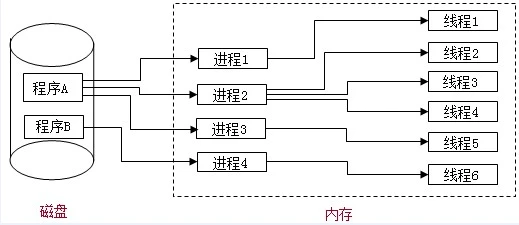

## 进程和线程

### 1. 进程

**进程是指程序的一次执行,它占有一片独有的内存空间**
同一个时间里，同一个计算机系统中允许两个或两个以上的进程处于并行状态，这是多进程。比如电脑同时运行微信，QQ，以及各种浏览器等。浏览器运行是有些是单进程，如firefox和老版IE，有些是多进程，如chrome和新版IE。

### 2. 线程

CPU的基本调度单位, 是程序执行的一个完整流程

有些进程还不止同时干一件事，比如Word，它可以同时进行打字、拼写检查、打印等事情。在一个进程内部，要同时干多件事，就需要同时运行多个“子任务”，我们把进程内的这些“子任务”称为线程（Thread）。

**线程是指CPU的基本调度单位,是程序执行的一个完整流程，是进程内的一个独立执行单元。**

多线程是指在一个进程内, 同时有多个线程运行。浏览器运行是多线程。比如用浏览器一边下载，一边听歌，一边看视频。另外我们需要知道JavaScript语言的一大特点就是单线程，为了利用多核CPU的计算能力，**HTML5提出Web Worker标准，允许JavaScript脚本创建多个线程，但是子线程完全受主线程控制，且不得操作DOM。所以，这个新标准并没有改变JavaScript单线程的本质。**

由于每个进程至少要干一件事，所以，一个进程至少有一个线程。当然，像Word这种复杂的进程可以有多个线程，多个线程可以同时执行，多线程的执行方式和多进程是一样的，也是由操作系统在多个线程之间快速切换，让每个线程都短暂地交替运行，看起来就像同时执行一样。当然，真正地同时执行多线程需要多核CPU才可能实现。

### 3. 进程与线程

应用程序必须运行在某个进程的某个线程上

一个进程中至少有一个运行的线程: 主线程, 进程启动后自动创建

一个进程中如果同时运行多个线程, 那这个程序是多线程运行的

一个进程内的数据可以供其中的多个线程直接共享

多个进程之间的数据是不能直接共享的

### 4.浏览器运行是单进程还是多进程?

有的是单进程
  firefox
  老版IE
有的是多进程
  chrome
  新版IE

### 5. 如何查看浏览器是否是多进程运行的呢?

任务管理器==>进程

### 6. 浏览器运行是单线程还是多线程?

都是多线程运行的
